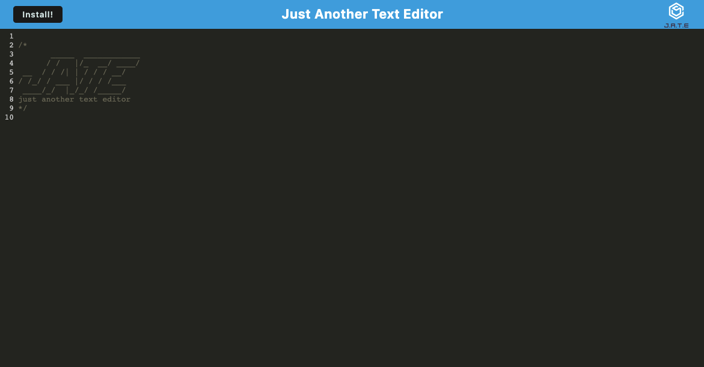
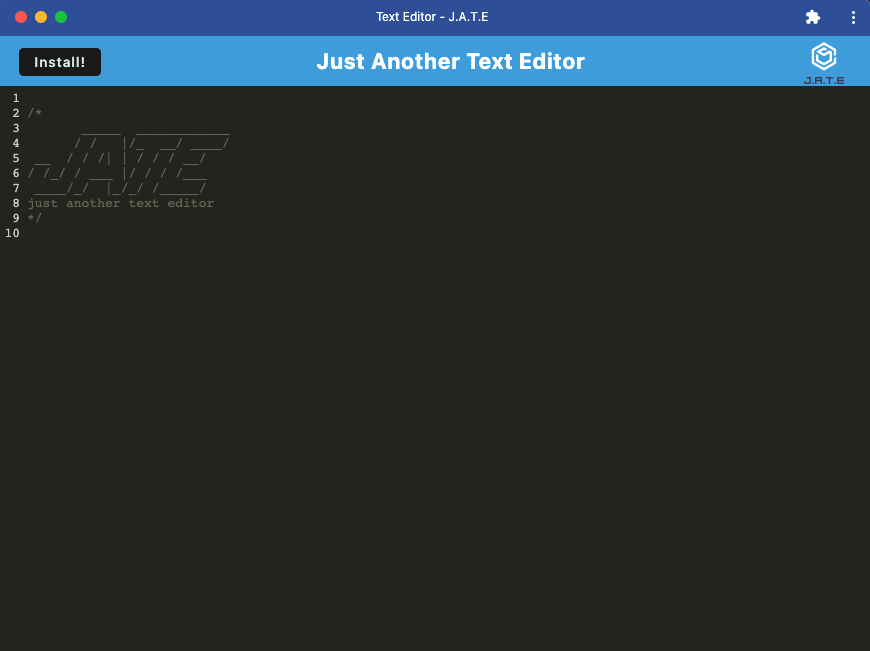

# Chapter 19 PWA: Text-Editor

by: Yonas Woldemichael

# 

Here is a screenshot taken before a team has been generated.

## Table of Contents
- [Description](#description)
- [Installation](#installation)
- [Visuals](#visuals)
- [Usage](#usage)

## Description
In this assignment the student was tasked with building a text editor that runs in the browser. The app will be a single-page application that meets the PWA criteria. Additionally, it will feature a number of data persistence techniques that serve as redundancy in case one of the options is not supported by the browser. The application will also function offline.

This assignment was also a great way for me to gain some hands on skills in using PWA's

## Notes

1. The Text editor allows you to type code into the page
2. PRovides you with an "install" button that permits you to use the app outside of the browser
3. The application can also be used while offline
4. Uses localstorage to store the inputed text and continue to display the text after refreshing the page.

## Visuals
Here is a screenshot of a generated team profile.

#
This is a screenshot of the app installed on the computer.

## Usage
The Text Editor allows you to write and edit code iwthin your borwser, while also being able to use it while offline.

[Link to the deplyed site]()

[Repository](https://github.com/Ybyonas1/dream-team-text-editor)

Thank You.